# 📊 BJJ Academy Bot - Flujo del Proceso

## 1. Flujo Principal de Conversación

```mermaid
sequenceDiagram
    participant U as Usuario (WhatsApp)
    participant W as Webhook Handler
    participant MP as Message Processor
    participant C as Cache (Redis)
    participant AI as AI Service
    participant DB as Database
    participant Cal as Calendar Service
    participant N as Notificaciones

    U->>W: Envía mensaje
    W->>W: Valida origen
    W->>MP: Procesa mensaje
    
    MP->>C: Busca contexto conversación
    alt Contexto existe
        C-->>MP: Retorna historial
    else No existe contexto
        MP->>DB: Crea nuevo lead
        DB-->>MP: Lead ID
    end
    
    MP->>AI: Genera respuesta con contexto
    AI-->>MP: Respuesta + intención
    
    alt Intención: Agendar clase
        MP->>Cal: Crear link de booking
        Cal-->>MP: URL calendario
        MP->>DB: Actualiza estado lead
    else Intención: Información
        MP->>DB: Log conversación
    end
    
    MP->>C: Actualiza contexto
    MP->>W: Respuesta final
    W->>U: Envía respuesta
    
    opt Follow-up programado
        MP->>N: Programa seguimiento
    end
```



## 2. Estados del Lead

```mermaid
stateDiagram-v2
    [*] --> NEW: Primer contacto
    NEW --> ENGAGED: Responde/Pregunta
    ENGAGED --> INTERESTED: Muestra interés en clase
    INTERESTED --> SCHEDULED: Agenda clase prueba
    SCHEDULED --> SHOWED_UP: Asiste a clase
    SCHEDULED --> NO_SHOW: No asiste
    SHOWED_UP --> CONVERTED: Se inscribe
    SHOWED_UP --> FOLLOW_UP: No se inscribe
    NO_SHOW --> RE_ENGAGED: Segundo intento
    FOLLOW_UP --> CONVERTED: Se inscribe después
    FOLLOW_UP --> LOST: No responde (30 días)
    RE_ENGAGED --> SCHEDULED: Re-agenda
    RE_ENGAGED --> LOST: No interesado
```



## 3. Procesamiento de Mensajes

### 3.1 Recepción
1. **Webhook recibe POST request** de WhatsApp/Meta
2. **Validación de seguridad** (token, signature)
3. **Parse del payload** según plataforma
4. **Enqueue para procesamiento async**

### 3.2 Análisis de Intención
```python
INTENCIONES = {
    "SALUDO": ["hola", "buenos días", "buenas"],
    "PRECIO": ["precio", "costo", "cuánto", "mensualidad"],
    "HORARIO": ["horario", "hora", "cuando", "días"],
    "UBICACION": ["donde", "dirección", "ubicación"],
    "CLASE_PRUEBA": ["probar", "prueba", "gratis", "primera clase"],
    "EXPERIENCIA": ["principiante", "nunca", "experiencia", "nivel"]
}
```

### 3.3 Generación de Respuesta
1. **Contexto = Historial + Info Academia + Estado Lead**
2. **Prompt Engineering** específico por intención
3. **Llamada a OpenAI/Claude** con contexto
4. **Post-procesamiento** (agregar links, CTAs)
5. **Validación** de respuesta antes de enviar

## 4. Integración con Calendar

### 4.1 Flujo de Agendamiento
```
Usuario expresa interés
    ↓
Bot detecta intención de agendar
    ↓
Genera link personalizado Cal.com
    ↓
Usuario selecciona horario
    ↓
Webhook recibe confirmación
    ↓
Actualiza estado lead → SCHEDULED
    ↓
Envía confirmación + recordatorios
```

### 4.2 Seguimiento Automático
- **T+1 hora**: Recordatorio de clase mañana
- **T+1 día post-clase**: ¿Cómo te fue?
- **T+3 días**: Oferta especial si no se inscribió
- **T+7 días**: Último follow-up
- **T+30 días**: Marca como LOST

## 5. Métricas y KPIs

### 5.1 Métricas de Conversación
- **Response Time**: Tiempo promedio de respuesta
- **Conversation Length**: Mensajes por conversación
- **Engagement Rate**: % de leads que responden
- **Intent Recognition**: Precisión de detección

### 5.2 Métricas de Negocio
- **Lead Generation**: Nuevos leads/día
- **Conversion Rate**: Leads → Clientes
- **Show-up Rate**: Agendados → Asistentes
- **LTV**: Valor de vida del cliente
- **CAC**: Costo de adquisición

### 5.3 Dashboard Metrics Query
```sql
-- Conversion Funnel
SELECT 
    DATE_TRUNC('week', created_at) as week,
    COUNT(*) FILTER (WHERE status = 'NEW') as new_leads,
    COUNT(*) FILTER (WHERE status = 'SCHEDULED') as scheduled,
    COUNT(*) FILTER (WHERE status = 'SHOWED_UP') as showed_up,
    COUNT(*) FILTER (WHERE status = 'CONVERTED') as converted,
    ROUND(100.0 * COUNT(*) FILTER (WHERE status = 'CONVERTED') / 
          NULLIF(COUNT(*), 0), 2) as conversion_rate
FROM leads
WHERE academy_id = :academy_id
GROUP BY week
ORDER BY week DESC;
```

## 6. Manejo de Errores

### 6.1 Estrategia de Retry
```python
RETRY_POLICY = {
    'max_retries': 3,
    'backoff_factor': 2,  # 2, 4, 8 seconds
    'retry_on': [
        ConnectionError,
        TimeoutError,
        RateLimitError
    ]
}
```

### 6.2 Fallback Messages
- **AI Service Down**: Mensaje predefinido + notificar admin
- **Calendar Full**: Sugerir otros horarios
- **Rate Limit**: Encolar para procesamiento posterior

## 7. Seguridad

### 7.1 Validaciones
- ✅ Webhook signature verification
- ✅ Rate limiting por número
- ✅ Input sanitization
- ✅ SQL injection prevention (ORM)
- ✅ API key rotation

### 7.2 Data Privacy
- Encriptación de PII en DB
- Logs sin información sensible
- GDPR compliance (derecho al olvido)
- Retención de datos: 90 días activos

## 8. Escalabilidad

### 8.1 Arquitectura para Crecimiento
```
Fase 1 (1-10 academias): Monolito + Celery
Fase 2 (10-100): Microservicios + K8s
Fase 3 (100+): Event-driven + Kafka
```

### 8.2 Optimizaciones
- **Caching**: Respuestas frecuentes en Redis
- **Batch Processing**: Mensajes en lotes
- **CDN**: Assets estáticos
- **DB Pooling**: Conexiones reutilizables
- **Async Everything**: Non-blocking I/O

## 9. Monitoring y Alertas

### 9.1 Métricas Técnicas
- CPU/Memory usage
- Response times (P50, P95, P99)
- Error rates
- Queue depths
- API rate limits

### 9.2 Alertas Críticas
- 🚨 AI Service timeout > 5s
- 🚨 Error rate > 5%
- 🚨 Queue depth > 1000
- 🚨 DB connection pool exhausted
- 🚨 Conversion rate drop > 20%

## 10. Deployment Pipeline

```yaml
CI/CD Flow:
  1. Git Push → GitHub
  2. GitHub Actions triggered
  3. Run tests (pytest)
  4. Build Docker image
  5. Push to registry
  6. Deploy to staging
  7. Run E2E tests
  8. Deploy to production
  9. Health checks
  10. Rollback if needed
```

## 11. Roadmap de Features

### Phase 1: MVP (Semanas 1-4)
- ✅ Recepción mensajes WhatsApp
- ✅ Respuestas con AI
- ✅ Gestión básica de leads
- ✅ Integración calendario

### Phase 2: Mejoras (Semanas 5-8)
- 📋 Multi-idioma (EN/ES/PT)
- 📋 Dashboard analytics
- 📋 Campañas de follow-up
- 📋 Integración con CRM

### Phase 3: Escala (Mes 3+)
- 📋 Multi-tenant completo
- 📋 Facebook/Instagram
- 📋 Pagos integrados
- 📋 API pública
- 📋 Mobile app